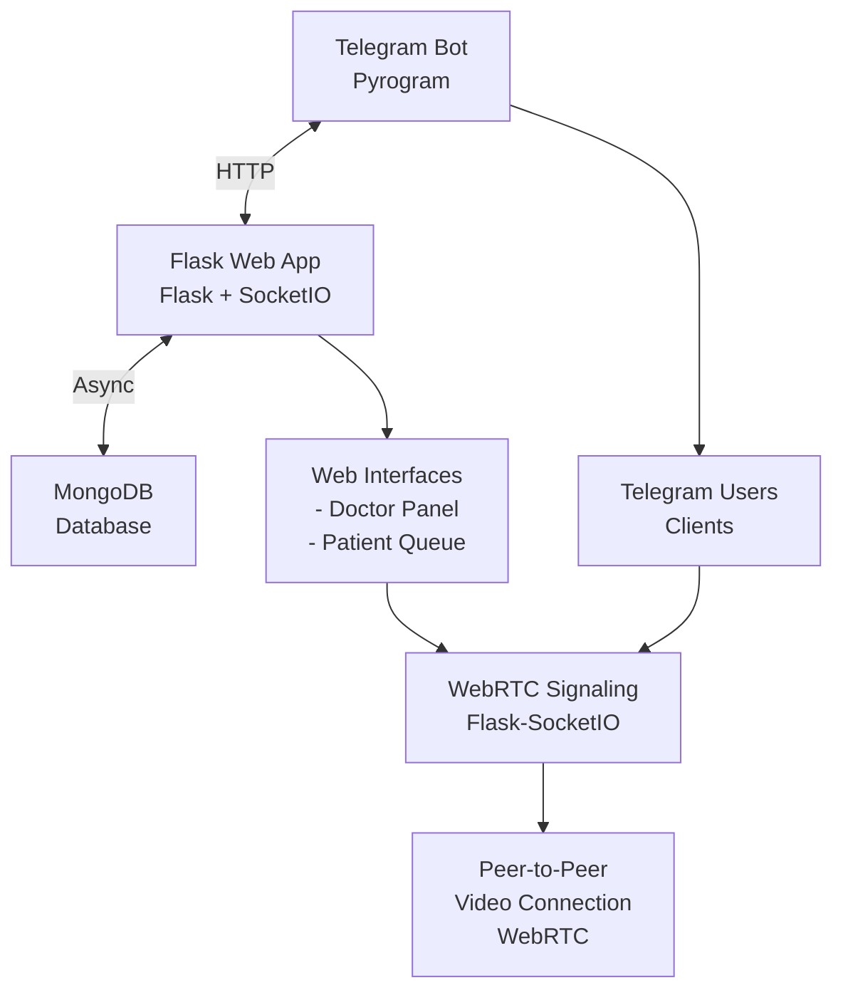
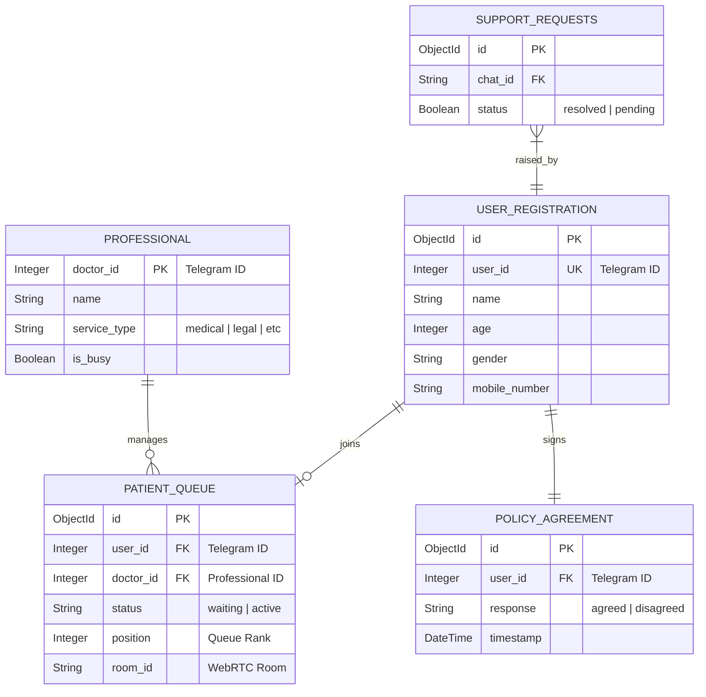
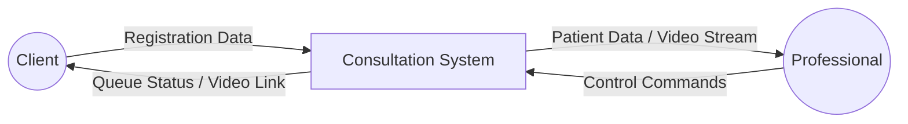
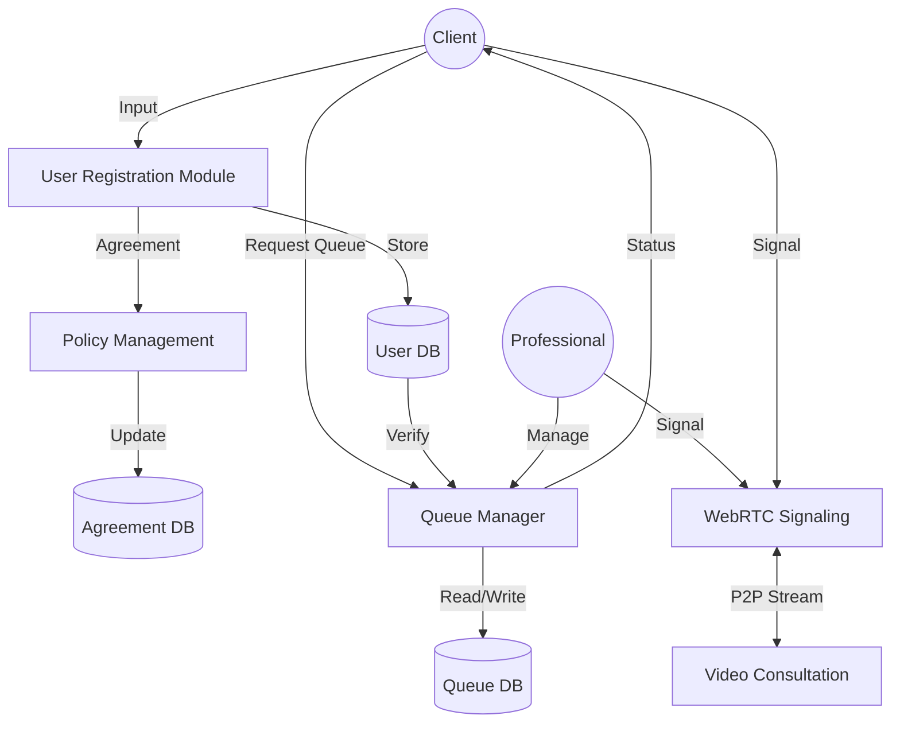
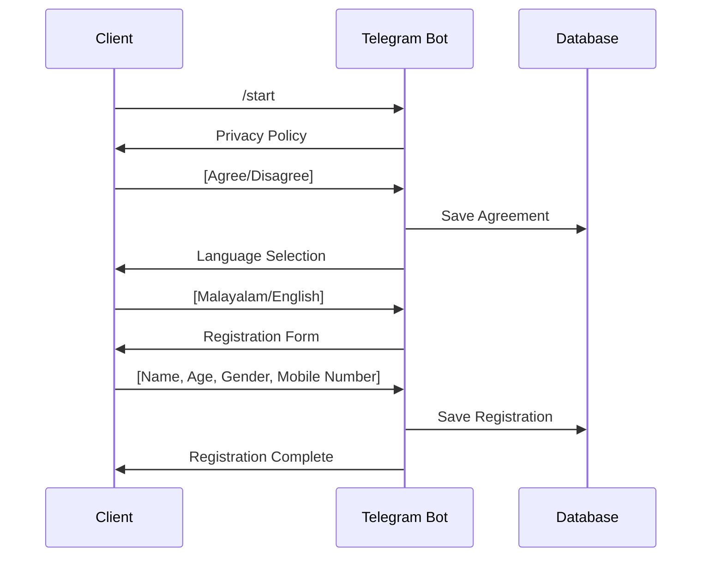
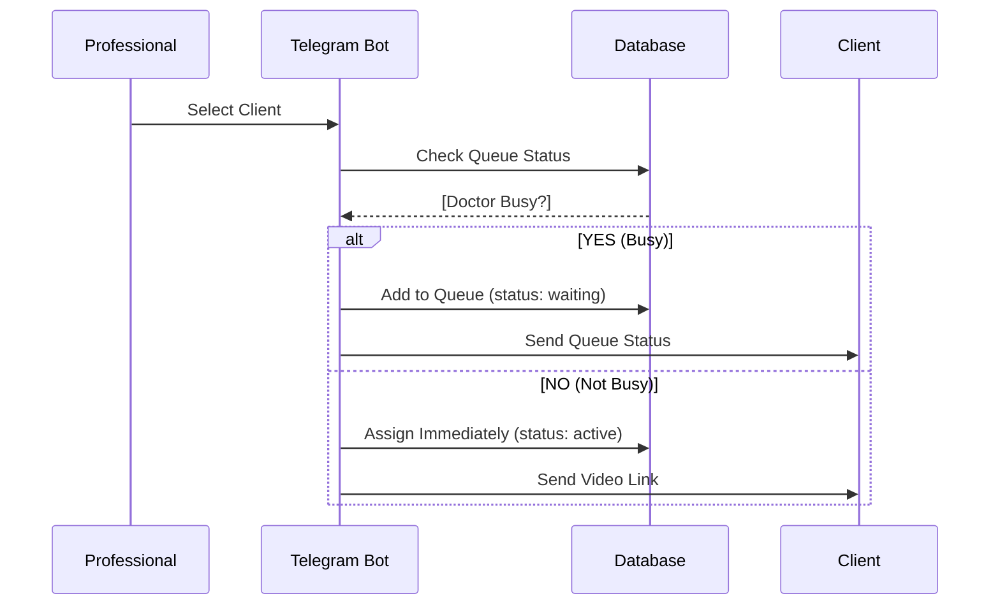
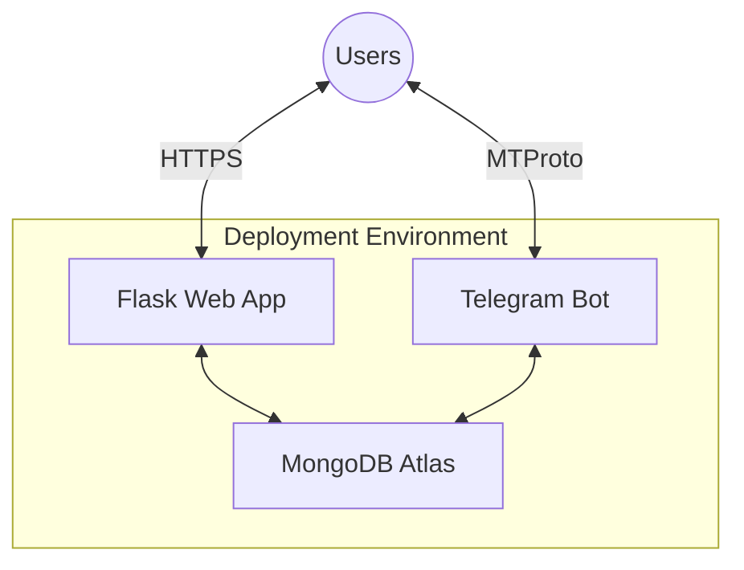

# Professional Consultation System - Project Documentation
**Academic Submission: BCA Final Year Project**
**University of Calicut**

## Table of Contents
1. [Project Profile](#project-profile)
2. [System Overview](#system-overview)
3. [System Architecture](#system-architecture)
4. [Requirement Analysis](#requirement-analysis)
5. [System Design (UML Diagrams)](#system-design-uml-diagrams)
    - [Use Case Diagram](#use-case-diagram)
    - [Entity Relationship (ER) Diagram](#entity-relationship-er-diagram)
    - [Data Flow Diagram (DFD - Level 0 & 1)](#data-flow-diagram-dfd)
6. [Database Schema](#database-schema)
7. [System Flows](#system-flows)
    - [User Registration Flow](#user-registration-flow)
    - [Queue Management Flow](#queue-management-flow)
    - [Video Call Flow (WebRTC)](#video-call-flow-webrtc)
8. [API Endpoints](#api-endpoints)
9. [Technology Stack](#technology-stack)
10. [Deployment Architecture](#deployment-architecture)
11. [Conclusion](#conclusion)

---

## Project Profile

| Project Detail | Description |
|---|---|
| **Project Title** | Real-time Professional Consultation System |
| **Domain** | Web Development / Real-time Communication (RTC) |
| **Technology** | Python (Flask), WebRTC, MongoDB, Telegram Bot API |
| **Platform** | Web (Mobile Responsive) & Telegram |
| **Type** | B2C (Professional to Client) |

---

## System Overview

This is a **multipurpose professional consultation system** designed for real-time video interactions. It bridges the gap between professionals (Doctors, Lawyers, Counselors) and clients through a seamless queue-based management system.

### Core Objectives
- Automate client registration via Telegram.
- Manage virtual queues efficiently for multiple professionals.
- Provide secure, low-latency peer-to-peer video consultation using WebRTC.
- Ensure cross-platform accessibility via Telegram Web Apps.

---

## System Architecture



---

## System Design (UML Diagrams)

### Use Case Diagram

```mermaid
usecaseDiagram
    actor "Client / Patient" as Client
    actor "Professional / Doctor" as Prof
    actor "System Admin" as Admin

    package "Consultation System" {
        usecase "Register via Telegram" as UC1
        usecase "Agree to Policy" as UC2
        usecase "Join Queue" as UC3
        usecase "View Live Status" as UC4
        usecase "Join Video Call" as UC5
        
        usecase "Login to Panel" as UC6
        usecase "Manage Queue (Next/Stop)" as UC7
        usecase "Initiate Video Call" as UC8
        usecase "Set Status (Busy/Available)" as UC9
        
        usecase "Manage Database" as UC10
    }

    Client --> UC1
    Client --> UC2
    Client --> UC3
    Client --> UC4
    Client --> UC5

    Prof --> UC6
    Prof --> UC7
    Prof --> UC8
    Prof --> UC9

    Admin --> UC10
```

### Entity Relationship (ER) Diagram

This diagram represents the logical structure of the database, showing entities, attributes, and their relationships.



### Data Flow Diagram (DFD)

#### Level 0: Context Diagram


#### Level 1: Functional DFD


---

## Database Schema (Physical Design)

### Collection: `userregistration`
Stores permanent profile data for clients.

### Collection: `patient_queue`
Stores transient data regarding current consultation sessions.

### Collection: `policy_agreement`
Audit log of privacy policy compliance.

---

## System Flows

### User Registration Flow


### Queue Management Flow


### Video Call Flow (WebRTC)
```mermaid
sequenceDiagram
    participant Prof as Professional (Initiator)
    participant Server as Signaling Server
    participant Client as Client (Receiver)

    Prof->>Server: Join Room
    Prof->>Prof: Create Offer
    Prof->>Server: Send Offer
    Server->>Client: Forward Offer
    Client->>Client: Create Answer
    Client->>Server: Send Answer
    Server->>Prof: Receive Answer
    Client<->Prof: Exchange ICE (NAT Traversal)
    Prof<->Client: Peer-to-Peer Video Stream
```

---

## API Endpoints

### Professional (Authenticated)
- `GET /api/queue`: Fetch live queue.
- `POST /api/next`: Advance to next client.
- `POST /api/stop`: End current session.

### Client (Public)
- `GET /api/patient/status`: Poll current queue position.
- `GET /api/patient/token`: Retrieve session token.

---

## Technology Stack

- **Frontend**: HTML5, CSS3, JavaScript (ES6+), Socket.IO Client.
- **Backend**: Python 3.10+, Flask (REST API), Flask-SocketIO (Signaling).
- **Database**: MongoDB Atlas (NoSQL).
- **Bot Framework**: Pyrogram (MTProto).
- **Communication**: WebRTC (Native Browser API).

---

## Deployment Architecture



---

## Conclusion

The **Professional Consultation System** provides a robust solution for virtual service delivery. By integrating Telegram for user management and WebRTC for real-time communication, it offers a cost-effective and scalable platform suitable for various professional domains. This project demonstrates the practical application of asynchronous programming, NoSQL database management, and peer-to-peer networking.

---

**Submitted for:** BCA Final Year Project  
**University:** University of Calicut  
**Academic Year:** 2023-2026
